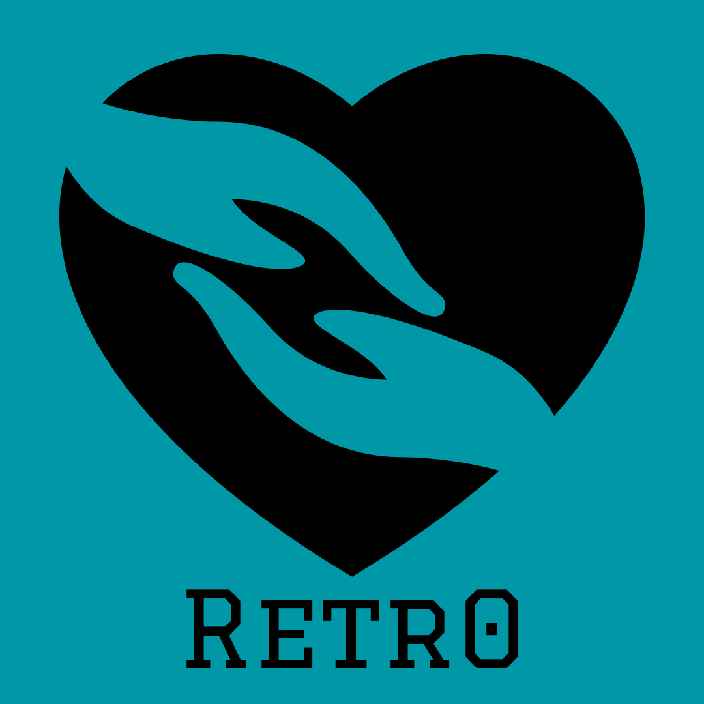

<!-- Back to the Top Div -->

 

<!-- Heading -->

  <!-- Logo -->
  
  <!-- Title of the App -->
  <h1>
    Retr0
  </h1>
  <!-- Brief Description of the app -->
  

    An easy to use Donation and Item exchange app.
  

<!-- Table of Contents -->

  
Table of Contents

  <ol>
    <li>
      <a href="#about_the_project">About the Project</a>
      <ul>
        <li><a href="#problem_statement">Description of Problem</a></li>
        <li><a href="#solution">Solution</a></li>
        <li><a href="#tech_stack">Tech Stack</a></li>
      </ul>
    </li>
    <li><a href="#getting_started">Getting Started</a></li>
    <li><a href="#features">Features</a></li>
    <li><a href="#contribution">Contribution</a></li>
    <li><a href="#special_thanks">Special Thanks</a></li>
  </ol>

<!-- About the Project -->
## About the Project
  
  

  <!-- Description of Problem Statement -->
  ### Description of Problem
  
  

  <!-- Our Solution to the Problem Statement -->
  ### Solution - Our App
  
  

  <!-- Tech stack used -->
  ### Tech Stack and API Used
  

<!-- Getting Started -->
## Getting Started

<!-- Features -->
## Features
  <!-- Implimented Features -->
  <!-- Future Expectations -->

<!-- Contribution -->
## Contribution
  <!-- Team Members with Email and GitHub Repos -->

  

<!-- Special Thanks to Avishkar -->
## Special Thanks
